# Feature Flags (Unleash)

It covers SDK setup, flag definition, usage, local development, and best practices for both **saas-legacy** and **Studio Manager**.

## SDK Setup & Provider

- The Unleash SDK is configured via a `FeatureFlagsProvider` at the app root (see [`FeatureFlagsProvider.tsx`](../apps/applications/saas-legacy/src/utils/feature-flag/FeatureFlagsProvider.tsx) for saas-legacy, [`FeatureFlagsProvider.tsx`](../packages/utils/sm-backbone/src/feature-flags/FeatureFlagsProvider.tsx) for Studio Manager).
- Provider loads user context (`companyId`, `franchiseId`, `userEmail` and bsport `environment`) and enables flag hooks throughout the app.
- Studio Manager: each app holds its own flag registry for modularity.
- Feature flag state is managed internally by the Unleash SDK and accessed via hooks (e.g., useFlag).

## Structure


See the Mermaid source diagram in [`feature_flags_structure.mmd`](./static/feature_flags_structure.mmd).

### Unleash Backend

Feature flags can be served from either:

- Local Unleash backend (for development)
- Cloud-hosted Unleash (for production/staging)

Configure the backend URL and client key via environment variables and CLI as described above.

---

## Defining & Using Flags

### Saas-Legacy

- Add to [`flags.ts`](../apps/applications/saas-legacy/src/utils/feature-flag/flags.ts):

```ts
export const FeatureFlags = {
  ...,
  MY_NEW_FEATURE: "my_new_feature",
} as const;
```

- Use in components:

```tsx
import { FeatureFlags, useSafeFlag } from "#src/utils/feature-flag";

const showFeature = useSafeFlag(FeatureFlags.MY_NEW_FEATURE);
```

> We have to `useSafeFlag` to avoid raising error if `FlagProvider` fails to load

#### Local Development

Unleash proxy URL and client key are hardcoded per environment in the deployment/build scripts and in the relevant file under `apps/applications/saas-legacy/envs/` (e.g. `envs/local`, `envs/production`).

### Studio Manager

- Add to [`featureFlags.ts`](../apps/applications/studio-manager/business-insights/insights/src/utils/featureFlags.ts):

```ts
import { makeFeatureFlags } from "@bsport/sm-backbone";

export const { flags, useFlag } = makeFeatureFlags({
  MY_NEW_FEATURE: "my_new_feature",
} as const);
```

- Use in components:

```tsx
import { flags, useFlag } from "#src/utils/featureFlags";

const showFeature = useFlag(flags.MY_NEW_FEATURE);
```

#### Local Development

- Start the Unleash backend (see infra docs or ask DevOps).
- Set env vars for proxy and client key using the CLI:

```sh
pnpm run -w feature-flags-environment:set local
```

- See `env` created in `packages/utils/sm-backbone`.
- Restart your app after changing flags or environment.

---

## Best Practices

- Always add new flags to the registry file.
- Use provided hooks for type safety.
- Never hardcode flag names in components.
- Studio Manager: each app maintains its own registry.
