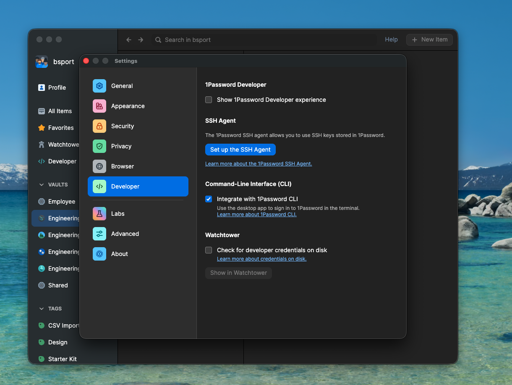

# Setting Up Nx Remote Cache Authentication

This tutorial configures your development environment to automatically
authenticate with our Nx remote cache server using mise.

## Prerequisites

- macOS or Ubuntu
- Access to the **Engineering** vault in 1Password
- [mise](https://mise.jdx.dev) installed and activated (see main [README](../README.md))

## Enable CLI Integration in 1Password

Before using the 1Password CLI, you must enable CLI integration in the 1Password desktop app:

1. Open **1Password** app
2. Go to **Settings** (⌘,)
3. Select **Developer** in the sidebar
4. Check **"Integrate with 1Password CLI"**



This allows the CLI to authenticate using your desktop app session.

## Connect 1Password CLI to your account

mise automatically installs the 1Password CLI. You just need to sign in:

```bash
eval $(op signin)
```

Follow the prompts to authenticate. You'll select your account and enter your password.

Test that you can access the Engineering vault:

```bash
op vault list
```

You should see `Engineering` in the list.

## Trust the project configuration

Navigate to the project directory and trust the mise configuration:

```bash
cd ~/path/to/ichizen
mise trust
```

mise will now automatically load the NX cache credentials from 1Password when you enter the project directory.

## Verify it works

Run a build command that uses the remote cache:

```bash
pnpm exec nx run-many --target=build --projects=tag:postinstall
```

Ideally for this to work you need to add a change to one of the packages tagged as postinstall or reset the nx cache `pnpm exec nx reset` so Nx is forced to hit the server, Nx is smart enough to use local cache whenever possible.

Then confirm the cache server received the request by checking Kibana:

1. Open the [Nx Remote Cache logs in Kibana](<https://kibana.tooling.bsport.io/app/discover#/view/6d4781b0-cc78-11f0-a894-ef3b91adb8fb?_g=(refreshInterval:(pause:!t,value:60000),time:(from:now-1h,to:now))&_a=(columns:!(log),filters:!(),hideChart:!f,index:'1fa37fc0-b523-4a48-a03f-d320919e1ef3',interval:auto,query:(language:kuery,query:'kubernetes.pod_name%20:%20%22*nx-cache*%22'),sort:!(!('@timestamp',desc)))>)
2. Look for logs from the last few minutes
3. You should see entries from the latest timestamps corresponding to your requests

If you see the requests in Kibana, your setup is complete.

## Troubleshooting

### mise

After setting up mise and executing `mise trust` you might see some errors and it is normal. They will go away after you mise install because they are associated to the tools mise has to install:

```
mise ERROR op is not a mise bin. Perhaps you need to install it first.
mise ERROR Run with --verbose or MISE_VERBOSE=1 for more information

```

### Nx commands failing and getting hanged

If after connected to Nx remote cache you have some issues with Nx hanging while running a command, please reset nx cache by running:

```shell
pnpm exec nx reset
```

If after that still give you problems -which is unlikely-, please quit and re-open your terminal emulator.

## What we accomplished

You now have:

- 1Password CLI installed via mise and connected to your account
- Automatic Nx remote cache authentication when entering the project

Every time you open a new terminal and `cd` into the project, mise will
load your credentials from 1Password automatically.
